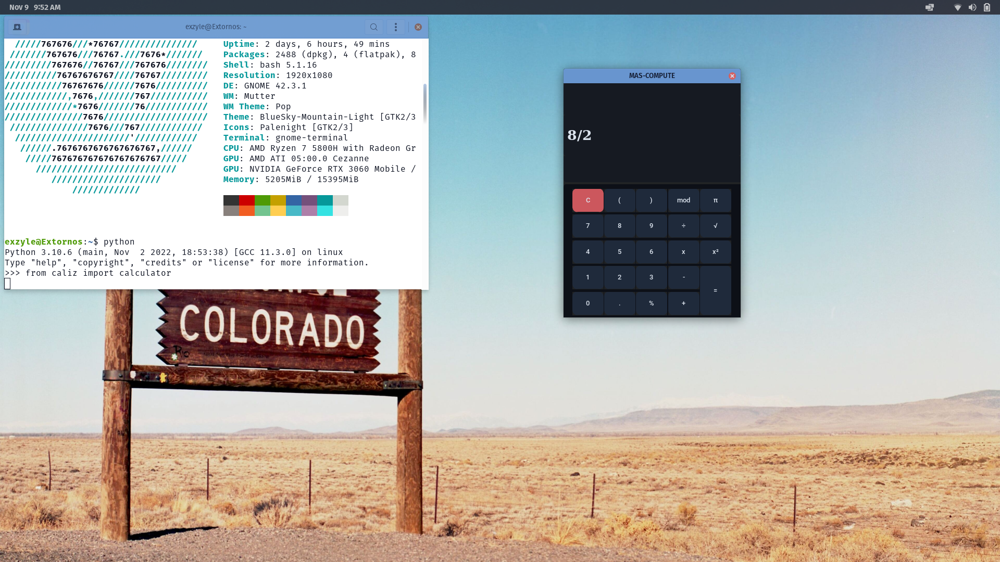

[PyPI](https://pypi.org/project/caliz/)

# CALIZ CALCULATOR WITH Python UI-LIB


| _`calculator.py` Demo View_

A new, modern look is provided by CALIZ-Calculator, a Python calculator based on CustomTkinter, The code should be easy to understand for beginner programmers and accessible to the users. Element by element Customtkinter has been used for the program.
You can use the system appearance or the manually set mode ('light', 'dark'), whichever you prefer, and you'll get a consistent appearance, Windows, macOS, and Linux all have a fresh, modern look.

## Installation
Install the module with pip:

## Requirements```
1. CustomTkinter
2. Tkinter

##Installation Process
pip3 install customtkinter
pip3 install tkinter or pip3 install tk

pip3 install caliz
```
**Update existing installation:** ```pip3 install caliz --upgrade```\
(update as often as possible because this library is under active development)

## Use-HowTO

After installing **CALIZ** go to python in terminal and import calculator from caliz library, 
i.e. --> **from caliz import calculator**
and the calculator will be shown to you.

If you need to get more info about CustomTkinter Go through the **Documentation** provided below,

## Documentation

The **official** documentation for CustomTkinter can be found in the Wiki Tab here:

**--> [Documentation](https://github.com/TomSchimansky/CustomTkinter/wiki)**.

Thank You From MAS.
